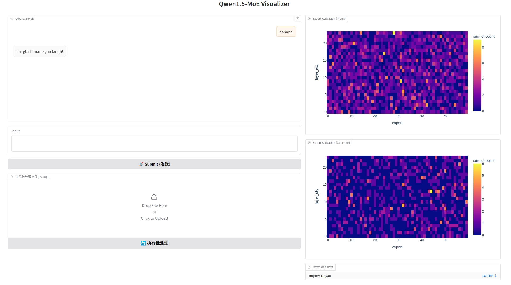

# MoE-Visualizer



## Introduction

This project is a visualizer for Mixture of Experts (MoE) models. We aim to provide a visual tool to help users understand the usage of experts in MoE models.

We designed a hook that can be mounted on a specific layer of the MoE model, which records which experts are used for each sample during inference. Ultimately, this allows us to count the usage of each expert.

Therefore, this is a plug-and-play module that can be used with any MoE model, with [Qwen1.5-MoE-A2.7B](https://huggingface.co/Qwen/Qwen1.5-MoE-A2.7B) provided as an example.

## What we have done
- [x] Visualize the usage of experts in prefill and generate phase
- [x] Support batch processing
- [x] Support downloading data

## Models we support
- [x] Support [Qwen1.5-MoE-A2.7B](https://huggingface.co/Qwen/Qwen1.5-MoE-A2.7B)

## How to use

### Step 1: Install the package
```bash
pip install -r requirements.txt
```

### Step 2: Run the demo
```bash
python qwen1_5_moe.py
```


If this project helps you, please give us a star. 🌟
